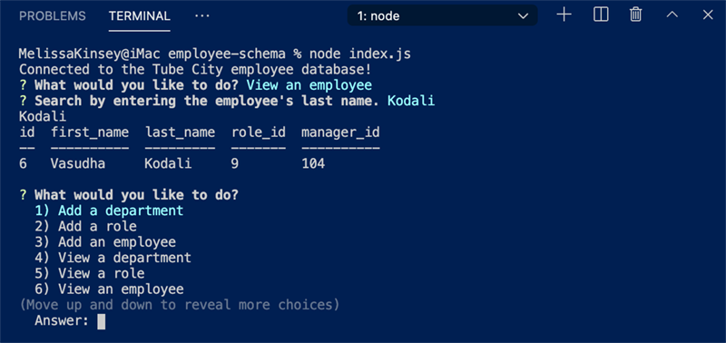

	

	

[Released under ](#license) by [@melissakinsey](https://github.com/melissakinsey).	
	
* [Description](#Description)
* [User Story](#User_Story)
* [Installation](#Installation)
* [Usage](#Usage)
* [Features](#Features)
* [Technical Specs](#Technical_Specs)
* [Lessons Learned](#Lessons_Learned)
* [Contributions](#Contributions)

	
# DESCRIPTION
This tool helps manage a company's employees using node, inquirer, and MySQL.

## Project Repo 
https://github.com/melissakinsey/employee-schema 
		
## USER STORY
*AS A* business owner *I WANT TO* view and manage the departments, roles, and employees in my company *SO I CAN* organize and plan my business.
	
	
# USAGE
To use this app, type 'node index.js' on the command line.
	
# FEATURES
This app makes it easy for nondevelopers to view and interact with content management systems (CMSs) and other databases. Users can access data—including names, id numbers, titles, and salaries—by employee, department, or role.
	
# TECHNICAL SPECS
* Runs on the command line. 
* Uses mySQL to store database records. 
* Uses npm inquirer to interact with users. 
* Formats data with npm console.table. 
	
# LESSONS LEARNED 
Working with SQL databases, schema, and tables helped me better nderstand the conceptual models used in entity relationship diagrams. Although I ended up scrapping it, I started out using a seed database containing 300,000 employee records. I could see how powerful SQL might be in slicing and dicing real demographic data in various ways, depending on the use case.  

# CONTRIBUTIONS
This was an individual project. Thanks, as always, to my study group and TAs!
	
# IMAGE CREDITS
* Header adapted from image by filo/iStockPhoto.  
* Badges created using Michael Currin's nifty [Badge Generator](https://michaelcurrin.github.io/badge-generator/#/repo)  

# QUESTIONS
To ask questions or contribute project feedback, ping me @melissakinsey (GitHub), @KinseyMelissa (Twitter) or kinsey.melissa@gmail.com.

